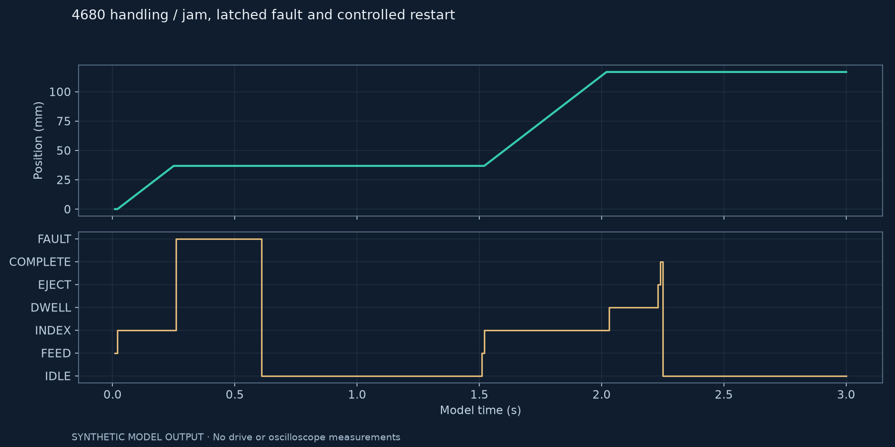

# 4680 Cell Controls Testbed

A small controls simulation for moving cylindrical cell surrogates through an infeed,
indexing nest and outfeed. The focus is the sequence around the motion: when a move is
allowed, what happens when a part jams, and what the operator must do before restarting.

Python runs the station model. An SCL function block is included for a future Siemens
implementation; it has not been compiled in TIA Portal.

## Station sequence

`IDLE → FEED → INDEX → DWELL → EJECT → COMPLETE`

The default recipe advances the indexer 80 mm at 160 mm/s, then holds for 200 ms.
Each active state has a 3 s timeout. A lost safety permissive, network fault, drive fault
or jam removes the motion requests and latches the first alarm.

Clearing the fault is not enough to restart. The operator must release start, reset,
then issue a new start command. Holding start does not run another cycle.



The trace shows a jam during the first index. The position holds while the fault is
latched; reset returns the sequence to idle. A later start completes a new relative move.
This also exposes a limitation: the model retains the stopped position. A physical
indexer would need to recover nest registration before handling the next part.

## Run

Python 3.10 or later, standard library only:

```sh
python -m unittest discover -s tests -v
python demo.py
```

The demo writes two 3 s traces to `results/`. The nominal run completes two cycles;
the jam run completes one. Eight tests cover sequencing, timeouts, recipe validation,
first-fault retention and restart behavior. Tests also check each fault in every active state.

## Files worth reading

| File | Contents |
|---|---|
| [model.py](model.py) | Sequence, recipe and idealized index motion |
| [test_model.py](tests/test_model.py) | Normal and fault cases |
| [FB_CellSequence.scl](plc/FB_CellSequence.scl) | PLC sequence draft using external IndexDone feedback |
| [I/O list](data/io.csv) | Signal names and intended interfaces |
| [Design notes](docs/DESIGN.md) | State behavior, assumptions and remaining work |
| [Architecture](assets/architecture.svg) | Functional station diagram |

## Current scope

The parts are inert surrogates; no battery chemistry or processing is modeled. Sensors
are scripted inputs and the axis has no inertia or drive loop. PROFINET integration,
homing and physical stopping tests are still to be done. The safety permissive is a
supervisory input, not a PROFIsafe implementation.

[Test status](docs/EVIDENCE.md) · [Commissioning plan](docs/COMMISSIONING.md) · [References](docs/REFERENCES.md)

## Next revision

[Proposed parameters and regression plan](docs/REQUIREMENTS.md). These targets are separate from the current model results.
