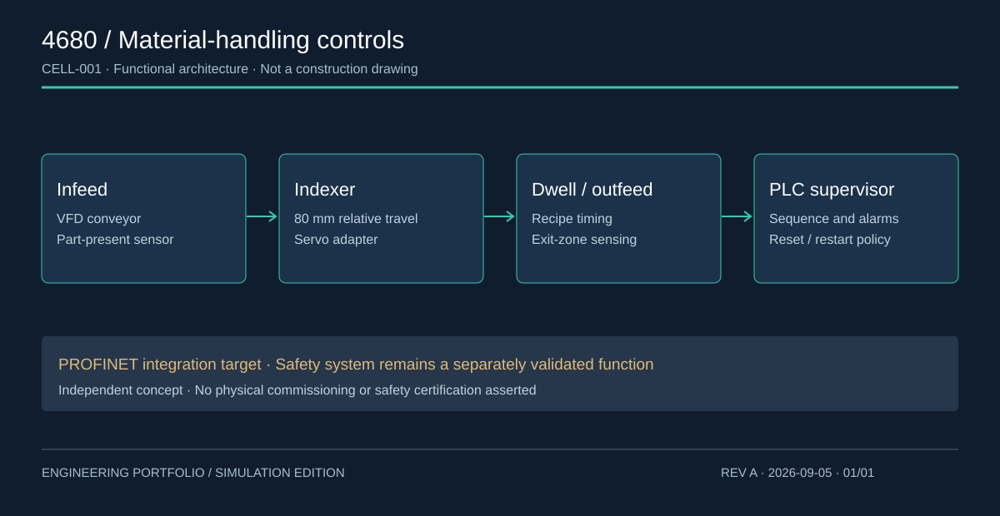

# 4680 Cell Manufacturing Controls Testbed

**Simulation & concept design · Revision A · 2026**

Siemens-oriented sequencing, recipe control, interlocks and jam recovery for an inert cylindrical-cell handling station.



## Run in under a minute

Requires Python 3.10+; no third-party packages, PLC license or hardware is needed.
From this repository's root:

```sh
python -m unittest discover -s tests -v
python demo.py
```

The demo writes reproducible evidence to `results/`. GitHub Actions runs the same
commands on push and pull requests. Review [local verification](results/verification.txt).

## Engineering package

- [Design basis and behavior](docs/DESIGN.md)
- [Architecture drawing](assets/architecture.svg)
- [Commissioning plan](docs/COMMISSIONING.md)
- [Evidence register](docs/EVIDENCE.md)
- [Primary references](docs/REFERENCES.md)
- [Example output](results/nominal.csv)
- Source and schedules: model.py, plc/FB_CellSequence.scl, data/io.csv

## What is demonstrated

Executable engineering logic, abnormal-condition tests, documented assumptions and
reviewable evidence. All traces are generated from the Python model. Native vendor
compilation, real fieldbus operation, hardware commissioning, drive tuning and
electrical/safety certification have not been performed. See the evidence register
for the exact boundary. PLC source, where included, is an uncompiled integration draft.

## Model results


## Review this project

Start with the design basis, inspect the tests, then run the demo and compare its
outputs with the saved evidence. Change one assumption and rerun the tests to explore
the response. Close the commissioning gates before advancing to hardware.
